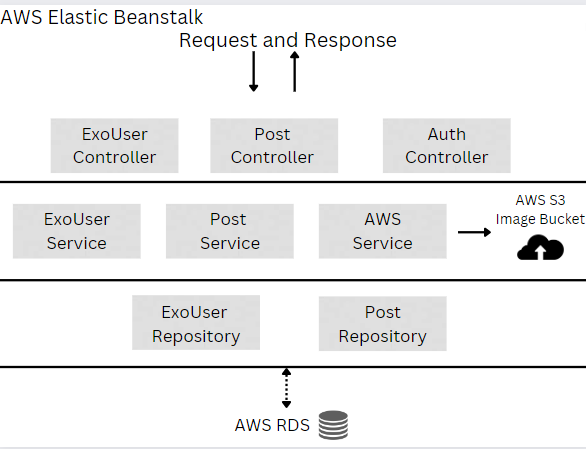
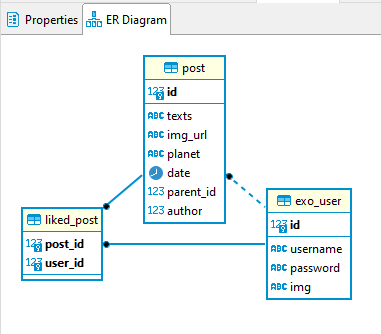
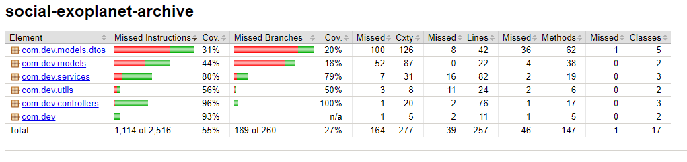

## Social Exoplanet Archive: Backend/API

## FlowChart

## Tech Stack
- [ ] Java 8
- [ ] Spring Boot
- [ ] Spring Data/JPA
- [ ] Spring WebMvc
- [ ] Spring MockMvc
- [ ] JUnit
- [ ] Mockito
- [ ] Maven
- [ ] AWS Elastic Beanstalk
- [ ] AWS RDS
- [ ] AWS EC2
- [ ] Postgresql
- [ ] Jacoco
- [ ] Git 

## Description
With this API User's(Secured with JWT tokens) have the possible use cases.

 - Register/Login
 - Add/Swap images
 - Create Posts
 - Reply to post's
 - Like post's
 
## ER-Diagram

### Jacoco Test Overview (Focus: Controllers & Service layers)

## Front End
- [Front End UI Repository that leverages this API](https://github.com/fsanche3/Social-Exoplanet-Archive-Frontend)

## Author
[Franklyn Sanchez](https://github.com/fsanche3)
